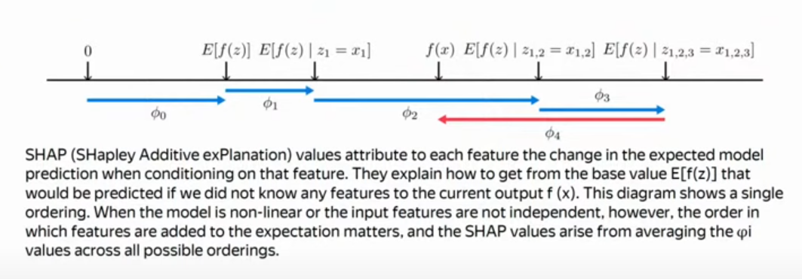

# Source

[From this video](https://www.youtube.com/watch?v=pkqQSygcFNk&list=WL&index=6)

# Bias-Variance(-Noise) decomposition

Ошибка раскладывается как шум, смещение и разброс. 

Рассмотрим разложение ошибки для задачи линейной регрессии с функцией потерь MSE.

## Noise

The expression $ \mathbb{E}_{x,y} \left[ (y - \mathbb{E}[y|x])^2 \right] $ represents the **variance of the noise** or **irreducible error**.

### 1. Conditional Expectation $ \mathbb{E}[y|x] $:
- This is the expected value of $ y $, the target variable, given a particular value of $ x $, the feature.
- In regression, $ \mathbb{E}[y|x] $ can be interpreted as the "true" or "best possible" prediction of $ y $ given $ x $ (it's often called the **regression function**).

### 2. The Difference $ y - \mathbb{E}[y|x] $:
- This represents the deviation of the actual value of $ y $ from the predicted (expected) value $ \mathbb{E}[y|x] $.
- This difference is called the **residual** or **error**: it's the amount by which the actual outcome $ y $ differs from the expected outcome based on $ x $.

### 3. Squaring the Residual $ (y - \mathbb{E}[y|x])^2 $:
- By squaring this difference, we are focusing on the magnitude of the error (without regard to its direction) and penalizing larger errors more heavily. This is a common approach in regression models, as it avoids cancellation of positive and negative errors.
  
### 4. Taking the Expectation $ \mathbb{E}_{x,y} \left[ (y - \mathbb{E}[y|x])^2 \right] $:
- Now, we compute the expectation (or average) of the squared residual across all possible values of $ x $ and $ y $, which gives the **total variance of the noise**.
- This is the **irreducible error**, because it's the variability in $ y $ that cannot be explained by $ x $. Even with the perfect model $ \mathbb{E}[y|x] $, there will still be some inherent randomness in $ y $, which is captured by this expression.

## Bias

The expression $ \mathbb{E}_{x} \left[ \left( \mathbb{E}_{X}[\mu(X)] - \mathbb{E}[y|x] \right)^2 \right] $ represents the **bias**.

### 1. Conditional Expectation $ \mathbb{E}[y|x] $:
- $ \mathbb{E}[y|x] $ is the true expected value of $ y $, the target variable, given a specific value of $ x $. It's often referred to as the **true regression function**.
- In machine learning, this represents the best possible prediction of $ y $ based on $ x $ (if we had perfect knowledge of the relationship between $ x $ and $ y $).

### 2. Model Prediction $ \mu(X) $:
- Here, $ \mu(X) $ represents the prediction made by a model when given input $ X $. It’s the prediction function learned from the data in a machine learning algorithm.
- The model $ \mu(X) $ may not be perfect due to factors like the choice of model, the limitations of training data, or optimization constraints.

### 3. Expected Model Prediction $ \mathbb{E}_{X}[\mu(X)] $:
- This is the **expected value of the model's prediction** over all possible training sets or inputs $ X $. It's important to understand that this expectation is taken over the distribution of possible datasets (i.e., training data).
- Since different training datasets can lead to slightly different models $ \mu(X) $, $ \mathbb{E}_{X}[\mu(X)] $ represents the average prediction made by the model across these datasets.

### 4. Bias Term $ \mathbb{E}_{x} \left[ \left( \mathbb{E}_{X}[\mu(X)] - \mathbb{E}[y|x] \right)^2 \right] $:
- The difference $ \mathbb{E}_{X}[\mu(X)] - \mathbb{E}[y|x] $ captures how far the **average model prediction** deviates from the **true conditional expectation** $ \mathbb{E}[y|x] $.
- The square of this difference, $ \left( \mathbb{E}_{X}[\mu(X)] - \mathbb{E}[y|x] \right)^2 $, measures how large the deviation is. By squaring, we ensure that larger deviations are penalized more and that positive and negative differences don't cancel out.
- Finally, taking the expectation over $ x $, $ \mathbb{E}_{x} \left[ \cdot \right] $, averages this squared deviation across all possible values of $ x $, giving the overall measure of **bias** in the model.

## Variance

The expression $ \mathbb{E}_{x} \left[ \mathbb{E}_{X} \left[ (\mu(X) - \mathbb{E}_{X}[\mu(X)])^2 \right] \right] $ represents the **variance** of a machine learning model's predictions, also known as the **model variance**.

### 1. Model Prediction $ \mu(X) $:
- $ \mu(X) $ is the prediction made by the model given a specific input $ X $.
- Since machine learning models are typically trained on datasets that are samples from the underlying population, the prediction $ \mu(X) $ will vary depending on the training dataset used.

### 2. Expected Prediction $ \mathbb{E}_{X}[\mu(X)] $:
- This is the expected value of the model’s predictions across different training datasets $ X $. 
- Since each training set $ X $ may lead to slightly different learned models, $ \mathbb{E}_{X}[\mu(X)] $ represents the **average prediction** of the model across all possible training sets.

### 3. Difference $ \mu(X) - \mathbb{E}_{X}[\mu(X)] $:
- This difference represents how far the model’s prediction for a specific training set deviates from the **average prediction** across all training sets.
- In other words, it captures the **fluctuations in the model’s prediction** due to variations in the training data.

### 4. Squaring the Difference $ (\mu(X) - \mathbb{E}_{X}[\mu(X)])^2 $:
- Squaring this difference gives the **squared deviation** of the model’s prediction from the average prediction. Squaring ensures that the deviations are positive and penalizes larger deviations more heavily.

### 5. Inner Expectation $ \mathbb{E}_{X} \left[ (\mu(X) - \mathbb{E}_{X}[\mu(X)])^2 \right] $:
- This expectation is taken over the distribution of training sets $ X $. It measures the **variance of the model’s predictions** due to different training sets.
- In other words, it tells us how sensitive the model is to the specific training data used. If the model’s predictions vary a lot depending on the training set, this variance will be high.

### 6. Outer Expectation $ \mathbb{E}_{x} \left[ \cdot \right] $:
- Finally, we take the expectation over $ x $, meaning we average this variance over all possible values of $ x $, the input features.
- This gives us the **overall variance** of the model across all inputs.

# Overfitting

Переобучение - запоминание моделью зависимостей, свойственных ТОЛЬКО обучающей выборке.

# Оценка значимости признаков

Если модель сложная и использует некоторую внутреннюю структуру данных, то использовать простые методы для расчета значимостей признаков - очень плохая идея.

## Model-specific methods

### Линейные модели

В линейных моделях мы можем оценить значимость признака посмотрев на вектор (матрицу) весов. Чем больше вес, чем больше значимость.

Весовые коэффициенты явно указывают какой линейный вклад внесли соответствующие признаки в значение таргета.

Однако это работает только в случае обучении модели на отнормированных данных.

Можно еще рассчитать стандартизованные коэффициенты значимости (в этом случае можно не нормировать выборку):
$$ w_i \cdot std(x_i)/std(y) $$

При добавлении регуляризации в линейную модель это позволяет добиться определенных свойств:

1. L2 (ridge) - все веса стараются быть одинаково маленькими (около нуля, но не ноль). Например, если у нас будет некоторая мульти-коррелирующая группа признаков, то rigde регуляризация веса этих признаков равномерно уменьшит до маленьких значений. 
2. L1 (lasso) - отбор всех наиболее значимых признаков, а все остальные будут занулены. 

Поэтому есть следующее правило:

* если у нас есть множество признаков, которые могут влиять на таргет не очень сильным образом, то можно использовать L2
* если же мы предполагаем что у выборки есть лишь несколько наиболее значимых признаков, а остальные не важны, то мы можем использовать L1 

Регуляризация = метод учета некоторых априорных знаний при решении задачи.

### Desicion trees

Значимость признаков при использовании деревьев можно оценить как среднее уменьшение энтропии (или в целом изменения любого выбранного критерия) при использовании признака при всех решаюших правилах деревьев.

Можно считать эту величину по-разному:
* по числу разбиений, в которых использовался этот признак
* по среднему уменьшению критерия
* взвешенно по числу разделенных объектов

ОДНАКО - это не самый хороший способ считать значимость, так как в целом мы могли бы обойтись и без самых важных (по рассчитанной таким образом значимости) признаков. 

Так же это всё можно рассчитать не по одному дереву, а по целым ансамблям. Рассчитывая эти величины в среднем по ансамблю.

ОДНАКО такие методы вычисления значимости признаков в деревьях дают смещенную оценку значимости признаков - оценка смещена в сторону непрерывных признаков, а так же дискретных признаков с большим возможным числом значений.

Большим плюсом деревьев и линейных моделей является интерпретируемость модели - мы по объекту можем явно сказать каким образом мы выбирали его таргет (пройти весь путь решающих правил). 

Интерпретируемость моделей важна в определенных областях (например область правового регулирования - пример модель которая выносит уголовный приговор - хотелось бы понимать почему именно был выбран тот или иной приговор)

Использовать одну модель для оценки значимости признаков и другую модель для предсказания таргетов нельзя. Так как всегда вычисленные значимости признаков определяются только для конкретной модели! То есть такие вычисленные значимости оценивают значимость признаков конкретно для модели, а не для самой зависимости выборки. 

Однако специальные методы LIME, SHAP позволяют оценивать значимость признаков, строя некоторые локальные модели (которые в некоторой локальной окрестности хорошо согласовываются с нашей целевой моделью) и на основе этих локальных моделей определяют значимость.

Если какие-то признаки являются неинформативными на основе вычисленных значимостей для одной модели, то это не будет означать что эти признаки будут также неинформативными и для другой модели.

Можно обучить несколько разных моделей и посчитать для каждой из них значимости признаков и усреднить их все - так мы получим чуть более понятную картину.

Анализируя значимость признаков мы можем построить более простое решение задачи.

### Drop feature importance (Метод исключения признака)

Мы можем обучить модель, исключив один из признаков, и оценить её качество. Повторяя это для каждого признака, мы можем определить, какие признаки наиболее важны для модели.

**Минусы:**
* Для этого метода нужно обучать модель множество раз — по числу признаков, что может быть вычислительно дорого.
* В случае, если признаки сильно коррелируют или дублируют друг друга, оценка значимости будет некорректной — исключение одного признака может не показать реальное влияние.
* Если есть группа признаков, которые вместе формируют важный информативный сигнал, исключение одного из них может неправильно снизить оценку их важности.

## Model-agnostic methods

Model-agnostic methods — это подходы для оценки важности признаков в моделях, не зависящие от типа модели. Эти методы помогают понять, как изменяется предсказательная способность модели, вместо анализа исходного набора данных.

Tools that only work for the interpretation of e.g. neural networks are model-specific. Model-agnostic tools can be used on any machine learning model and are applied after the model has been trained (post hoc). These agnostic methods usually work by analyzing feature input and output pairs.

### Permutation importance (Перестановочная важность признаков)

Этот метод работает на уже обученной модели, даже если модель для нас является "черным ящиком" — мы знаем только входы и выходы.

**Описание метода:**
1. Перемешиваем значения одного из признаков в тестовом наборе данных, сохраняя остальные признаки неизменными.
2. Прогоняем измененный тестовый набор через модель и оцениваем, насколько ухудшилось качество предсказаний.

Идея заключается в том, что перемешивание одного признака вносит "шум", и если это значительно снижает точность модели, то признак важен. Если же качество предсказаний остается почти на прежнем уровне, то признак маловажен.

**Преимущества:**
- Этот метод не требует многократного обучения модели.
- Подходит для любых типов моделей, в том числе и для "черных ящиков".
  
**Минусы:**
- Может давать некорректные результаты для сильно коррелированных признаков, так как перемешивание одного признака может не сильно изменить результат, если другие признаки компенсируют его влияние.

### LIME - Local Interpretable Model-agnostic Explanations

1. Пусть у нас есть некоторая уже обученная модель $f$
2. Вводим некоторое семейство "простых" моделей, которое будет в некоторой локальной окрестности пространства входов аппроксимировать нашу уже обученную модель:
$$ \exists x_0 \in X: g \in G: g(x_0) \approx f(x_0)$$
3. Вводим некоторую функцию близости объектов в окрестности (например, экспоненциальная близость) $\pi_x(z)$ и функцию сложности "простых" моделей $\Omega(g)$
4. Вводим также функцию, которая оценивает качество аппроксимации $ L(f, g, \pi_x) $ (большие значения значат что аппроксимация хуже)
5. Цель метода LIME - найти такие параметры простых моделей для каждой окрестности пространства, чтобы уменьшить меру аппроксимации простой моделью обученной модели
$$ \xi(x) = argmin_{g \in G} (L(f, g, \pi_x) + \Omega(g)) $$

То есть мы берем некоторую окрестность и аппроксимируем её например линейной моделью с регуляризацией. Затем найдя параметры весов, можем посмотреть какие признаки наиболее значимы именно в этой окрестности. 

[Наглядный пример LIME на слайде 21](feature_importance.pdf).

На смену LIME пришел SHAP

### Shapley values. SHAP - SHapely Additive exPlanations

[SHAP Github](https://github.com/shap/shap)

[SHAP Docs](https://shap.readthedocs.io/en/latest/)

#### Overview

**SHAP (SHapley Additive exPlanations)** может быть как **model-agnostic**, так и **model-specific**, в зависимости от того, как он применяется.

##### 1. **Model-agnostic версия SHAP**:
- **Model-agnostic SHAP** вычисляет объяснения для любых моделей, включая "черные ящики" (например, сложные нейронные сети, ансамблевые модели).
- Чтобы получить SHAP-значения для model-agnostic версии, используется метод Монте-Карло или апроксимации, которые требуют многократного изменения входных данных и оценки модели. Это действительно может быть вычислительно дорого, так как предполагается использование большого числа подвыборок (сэмплирования) для каждого признака, но при этом сам процесс не требует доступа к внутренним параметрам модели.
  
Таким образом, **model-agnostic SHAP** не требует повторного обучения модели. Он использует уже обученную модель, и вычисления основаны на её предсказаниях, что делает его независимым от структуры модели.

##### 2. **Model-specific версия SHAP**:
- Есть версии SHAP, оптимизированные для конкретных моделей. Например, **TreeSHAP** — это метод, специально разработанный для деревьев решений и ансамблей деревьев (например, Random Forest, XGBoost). 
- В этих версиях используются внутренние параметры модели (например, структура дерева) для быстрого и точного вычисления SHAP-значений. В таких случаях SHAP становится **model-specific** методом, так как использует особенности конкретной модели для ускорения вычислений.

#### Algorithm

Предлагается взять 2 модели и обучить одну на некотором подмножестве множества признаков, а другую обучить на это же подмножестве, но с некоторой выкинутой фичей. Затем повторить это для некоторого числа подмножеств и усреднить некоторым образом (там будет коэффициент который показывает скольким образом мы можем выбрать подмножество некоторого размера из всего множества признаков) различия предсказаний этих моделей. Полученное значение (shapley value) будет являться значимостью выкинутого признака.

[Формулы (слайд 24)](feature_importance.pdf)

Получается, что чтобы посмотреть на значимость признаков нам требуется обучить огромное число моделей. Но зато эти Shapley value говорят по сути о значимости признака (с точки зрения теории игр).

По сути у нас в SHAP тоже будет какая-то локально аппроксимирующая модель.

Также в работе про SHAP предлагается 3 свойства:
1. Локальная точность: в некоторой области у нас предсказание модели может быть представлено в виде какой-то контанты + взвешенная сумма признаков (признаков, на которых обучалась модель), где в качестве весов являются shap values (вычисленные значимости):
$$ f(x) \approx g(\hat{x}) = \phi_0 + \sum_{i} \phi_i \cdot \hat{x_i} $$
2. Если признак отсутствует, то его значимость должна быть гарантированно = 0:
$$ \hat{x_i} = 0 \rightarrow \phi_i = 0 $$
3. consistency: формула в pdf

В представленной работе по SHAP доказывается теорема, что это единственный способ оценить значимость признаков для модели, который будет удовлетворять свойствам выше.

На практике оценка значимости признаков с помощью SHAP предполагает следующее:  
Пусть у нас в каждой точке выборки есть какое-то предсказание целевой переменной и мы будем смотреть на 2 вещи:

1. ожидаемое значение (везде это будет мат ожидание, однако при разных подномжетсвах мноежства признаков) целевой переменной (например среднее по всей выборке) - то есть когда у нас вообще нет никаких признаков (например для дерева в этом случае у нас будет случай что все признаки пропущены и мы идем по всем веткам и затем усредняем значения в листах с коэффициентами мощностей попавших туда выборок)

2. как наличие каждого признака (то есть мы последовательно добавляем по одному признаку и от него считаем предсказания модели) сдвигает наше предсказание от среднего (предыдущего среднего по меньшему подмножеству признаков) к тому предсказанию которое мы получили

То есть значение вектора SHAP показывает насколько изменится предсказание нашей модели от математического ожидания предсказаний если она будет учитывать соответствующий этому значению SHAP признак.

#### Применение SHAP

__Tree-SHAP__

SHAP прекрасно работает с деревьями, так как по ним можно легко вычислять мат ожидание ответа модели для выборки с некоторым подмножеством признаков, НЕ СТРОЯ ДОПОЛНИТЕЛЬНЫЕ МОДЕЛИ И НЕ ОБУЧАЯ ИХ НА РАЗНЫХ ПОДВЫБОРКАХ ПРИЗНАКОВ. То есть можно исопльзовать одну модель, построенную для всех признаков для расчета всего вектора shapley values.

SHAP - лучший способ оценки значимости признаков классических моделей (не нейронок).

То есть для ансамблей деревьев интерпретировать ответ для какого-то входа достаточно сложно, а вот оценить значимость признаков можно достаточно хорошо используя SHAP.

Графики SHAP (как график самого вектора SHAP, так и график значений SHAP по всей выборке) очень информативны и позволяют проводить хороший анализ нашей выборки.

Для нейронок SHAP тоже используется, однако там уже вычисляется некоторая аппроксимация вектора shapley values. И он оценивается некоторыми градиентными методами. 
Например DeepExplainer и GradientExplainer 

### (Grad-)CAM(++)

Рассмотрим методы оценки значимостей признаков для данных со сложной внутренней структурой.

#### CAM - Class Activation Mapping

Делаем усредняющий (по длине-ширине) слой после сверточных слоев. И затем этот вектор (длиной с depth) используем для предсказания (через полносвязный слой (линейную регр/класс)). И затем мы прокидываем обратно эти веса на первый слой и соответственно можем получить картинки для каждого класса с пикселями, которые наиболее всего вносят вклад в предсказание.

Это метод для определенной архитектуры нейронной сети.

### GradCAM

Тут мы просто дифференцируем наши предсказания по входным пикселям. И таким образом получаем Class activation maps.

### GradCAM++

Усовершенствование GradCAM, там исопльзуется ReLU под капотом для отбрасывания всех отрицательных импактов и еще чето.